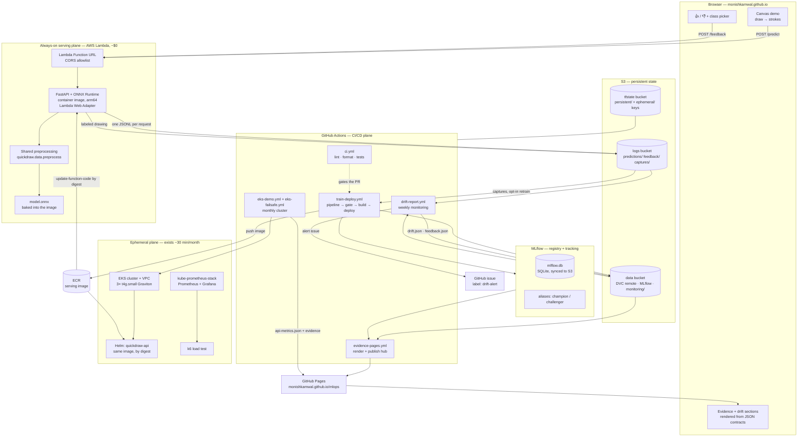
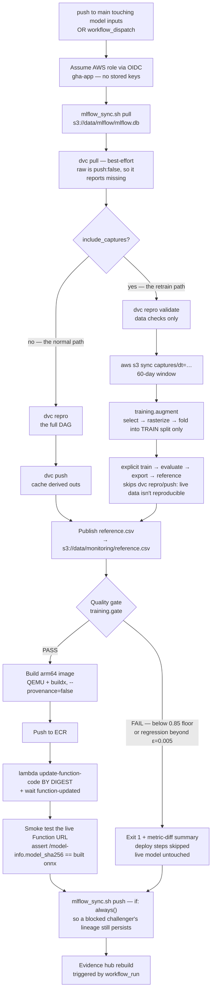
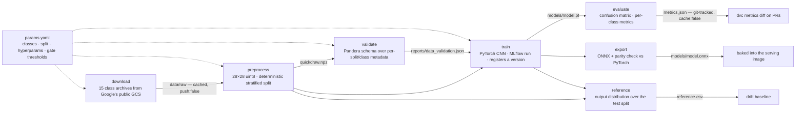
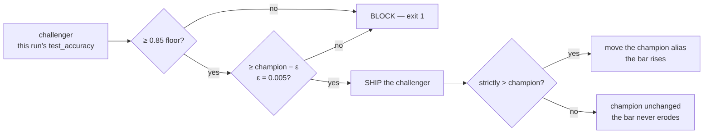
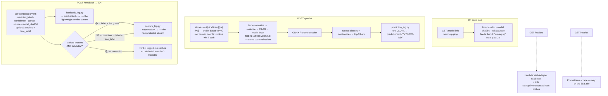
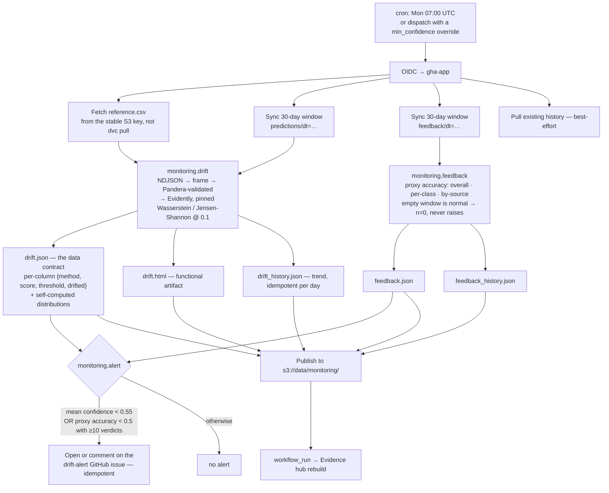
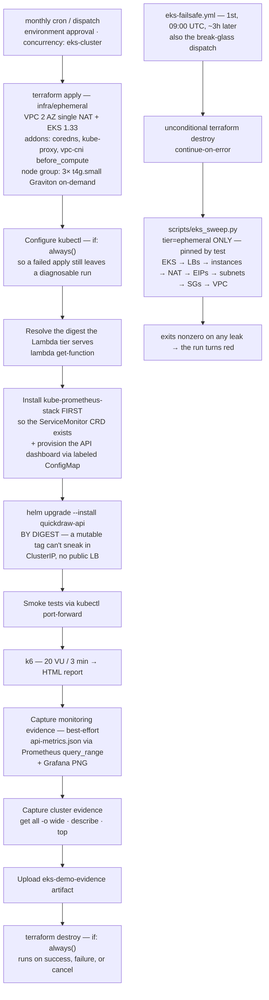
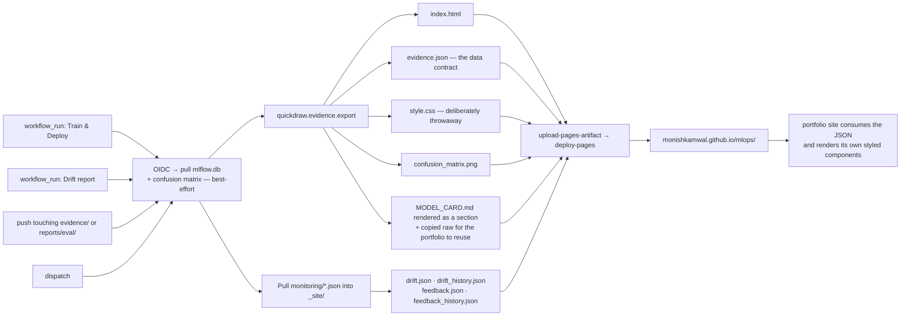

# Architecture

The full system, plane by plane. This is the **detailed** reference — every step that actually
runs, drawn from the workflows, the DVC DAG, and the Terraform roots. The portfolio site carries
a slimmed-down version of §1; the rest is here for depth and for the README.

Design rationale for each choice lives in [`PLAN.md` §2](PLAN.md); this document is *what happens*,
not *why that tool*.

---

## 1. System overview

Four planes: an always-on serving plane at ~$0, a CI/CD plane on GitHub Actions, an ephemeral
Kubernetes plane that exists ~30 minutes a month, and a monitoring plane that closes the loop
back into training.

**The one-sentence version:** a visitor's drawing becomes a prediction, a log line, and — if they
grade it — labeled training data; every merge retrains, gates, and redeploys the model without a
human; every week the logs are scored for drift; every artifact behind those claims is published.

---

## 2. Training & deploy plane — `train-deploy.yml`

Fires on push to `main` touching model inputs — `config.py`, `data/**`, `training/**`,
`serving/**`, `dvc.yaml`, `dvc.lock`, `params.yaml`, `Dockerfile`, `uv.lock` — or on manual
dispatch. `concurrency: train-deploy`, no cancel-in-progress: a single writer for `mlflow.db`.

### The DVC DAG inside `dvc repro`

Each stage hashes its code deps + `params.yaml` sections; only what changed re-runs.

The `validate → train` dependency edge is what makes validation a **gate** rather than a sibling
stage: no report, no training.

### Gate semantics

**Deploy and re-crown are decoupled.** Passing means "ship this"; the `champion` alias moves only
on a strict improvement, so champion is the best-ever quality bar rather than a record of what's
live. Nothing tracks "currently deployed" by alias — the built image digest is the source of truth.

---

## 3. Serving plane — the request path

One FastAPI + ONNX Runtime container image, arm64. It runs unmodified on Lambda (via the Lambda
Web Adapter), under `docker run` locally, and on EKS — no code fork between tiers.

Three properties worth stating out loud:

- **No train/serve skew by construction.** The browser sends the raw drawing; every transform down
  to the 28×28 tensor happens server-side in the same module the training pipeline imports. Parity
  tests enforce it.
- **All logging is fail-open.** An S3 outage costs a log line, never a prediction.
- **Writes are synchronous.** Lambda freezes after the response, so a background task would lose
  data.
- **Privacy-first by default.** The prediction log stores `input_sha256`, never pixels. Drawings
  are captured *only* on an explicit 👍/👎 with an upfront consent notice — no identity, no tracking.

---

## 4. Monitoring plane — `drift-report.yml`

Weekly, Mondays 07:00 UTC, plus dispatch. Drift is measured on the model's **output** distribution
— predicted-class mix, top-1 confidence, top1−top2 margin — not on input pixels, because the
prediction log deliberately doesn't retain them.

**The key design call:** it does *not* alert on the ever-present OOD drift. Real doodles are
out-of-distribution against QuickDraw's bitmaps by definition — that fires every week and means
nothing. It alerts only when the model is doing *badly* on real drawings: a confidence collapse or
a proxy-accuracy floor breach. The OOD drift is still measured and published; it's just not
paged on.

---

## 5. The retrain flywheel

The loop that closes the system — a visitor's correction becomes training data.

```mermaid
flowchart LR
    DRAW["visitor draws"] --> PRED["prediction"] --> GRADE{"👍 / 👎"}
    GRADE -->|"👍"| CAP1["capture, label = the guess"]
    GRADE -->|"👎 + class picker"| CAP2["capture, label = the correction<br/>the model's actual errors — the valuable half"]
    CAP1 & CAP2 --> S3C[("captures/dt=…")]

    S3C -->|"opt-in: dispatch with include_captures=true"| SEL
    SEL["select_captures — quality bar<br/>👍 kept only if conf ≥ 0.7 · all 👎-with-label kept · per-class cap 500"]
    SEL --> RAST["rasterize_captures<br/>via the shared rasterize_strokes → no skew"]
    RAST --> FOLD["augment_npz<br/>extends the TRAIN split only"]
    FOLD --> HONEST["val/test stay pristine → honest eval"]
    HONEST --> RETRAIN["train → evaluate → export → reference"]
    RETRAIN --> GATE2["the same quality gate decides"]
    GATE2 --> DEPLOY2["ship or block"]
    DEPLOY2 --> DRAW
```

Demonstrated end-to-end on 2026-07-24 (run 30061303377): 4 captures folded → v14 registered at
test 0.9163 → gate PASS within ε → deployed. Four captures against 120k is negligible by design;
what the run proves is the *mechanism*, not a metric gain.

---

## 6. Ephemeral Kubernetes plane — `eks-demo.yml`

Monthly (1st, 06:00 UTC) or dispatch, behind an `eks-demo` environment approval gate. The cluster
exists for the length of the run and is destroyed unconditionally.

Three teardown layers, because a leaked cluster + NAT is ~$8–10/day: the `if: always()` destroy,
the scheduled failsafe sweep, and the same failsafe as a manual break-glass button. The two
Terraform roots are split precisely so this plane *physically cannot* touch state, data, or the
live API.

---

## 7. Evidence plane — `evidence-pages.yml`

Every claim in the portfolio resolves to a public artifact. The hub is rendered from the **MLflow
registry**, not from a checked-in metrics snapshot, so it can't drift from what actually shipped.

**The data-contract rule:** every public-facing output ships as JSON that the portfolio styles
itself — `evidence.json`, `drift.json`, `feedback.json`, `api-metrics.json`, and the two history
files. Generated HTML and Grafana PNGs are demoted to functional/dev artifacts. The site's look
belongs to the site.

---

## 8. Storage map

| Bucket | Prefix | Written by | Read by |
|---|---|---|---|
| `mlops-quickdraw-logs-ab1b` | `predictions/dt=…/` | serving, per request | drift report — 30-day window |
| | `feedback/dt=…/` | serving, on 👍/👎 | proxy accuracy — 30-day window |
| | `captures/dt=…/` | serving, on a labeled verdict | retrain path — 60-day window |
| `mlops-quickdraw-data-ab1b` | `dvc/` | `dvc push` in train-deploy | `dvc pull` |
| | `mlflow/mlflow.db` | `mlflow_sync.sh push` | gate, evidence hub |
| | `mlflow/artifacts/…` | MLflow natively — absolute `s3://` URIs, portable across machines | registry |
| | `monitoring/reference.csv` | train-deploy, stable key | drift report |
| | `monitoring/*.json` | drift report | evidence hub |
| `mlops-quickdraw-tfstate-k7f2` | `persistent/`, `ephemeral/` | Terraform, native S3 locking | Terraform |

The two Terraform roots use physically separate state keys, and the ephemeral role's IAM is scoped
so it can't reach the persistent tier's state.

---

## 9. Triggers

| Workflow | Trigger | Guardrails |
|---|---|---|
| `ci.yml` | every PR + push to `main` | lint · format · tests |
| `train-deploy.yml` | push to `main` touching model inputs; dispatch | `concurrency: train-deploy`, single mlflow writer; quality gate |
| `drift-report.yml` | Mon 07:00 UTC; dispatch | empty window is a valid result, never an error |
| `evidence-pages.yml` | after Train & Deploy or Drift report; evidence-source pushes; dispatch | `concurrency: evidence-pages`, no cancel |
| `eks-demo.yml` | 1st of month 06:00 UTC; dispatch | environment approval · `concurrency: eks-cluster` · `if: always()` destroy · per-job timeouts |
| `eks-failsafe.yml` | 1st of month 09:00 UTC; dispatch | no approval gate — it must run unattended; `tier=ephemeral` only |

---

## 10. Identity & permissions

No AWS keys exist anywhere. GitHub Actions mints an OIDC token and assumes one of two roles:

- **`gha-app`** — the application lifecycle: S3 on both buckets, ECR push, `lambda:UpdateFunctionCode`
  on `quickdraw-*`. Used by train-deploy, drift-report, evidence-pages.
- **`gha-eks`** — the ephemeral lifecycle only: region-scoped `ec2`/`eks`/`elb`/`autoscaling`/`logs`,
  IAM bounded to `role/quickdraw-ephemeral*` so "can create IAM roles" can't escalate to admin, plus
  the ephemeral state prefix.

The Lambda execution role can only `PutObject` to `predictions/*`, `feedback/*`, and `captures/*` —
append-only, no read, no delete.

---

## 11. The portfolio cut

This document is the deep version. The site carries a trimmed one; the trim, in priority order:

1. Keep **§1** as the hero diagram — collapse the four planes to four boxes and drop the S3 prefix
   detail from the node labels.
2. Keep the **flywheel (§5)** — it's the most distinctive part of the story and reads in one glance.
3. Keep the **gate (§2.3)** as a small inset; the ship-vs-re-crown split is the sharpest single idea
   in the project.
4. Cut §8–10 entirely — storage maps and IAM scoping are README material, not site material.
5. Cut the DVC DAG unless the site has a "reproducibility" section to hang it on.
6. §6 collapses well to three nodes: apply → exercise → destroy, with the failsafe as a footnote.
