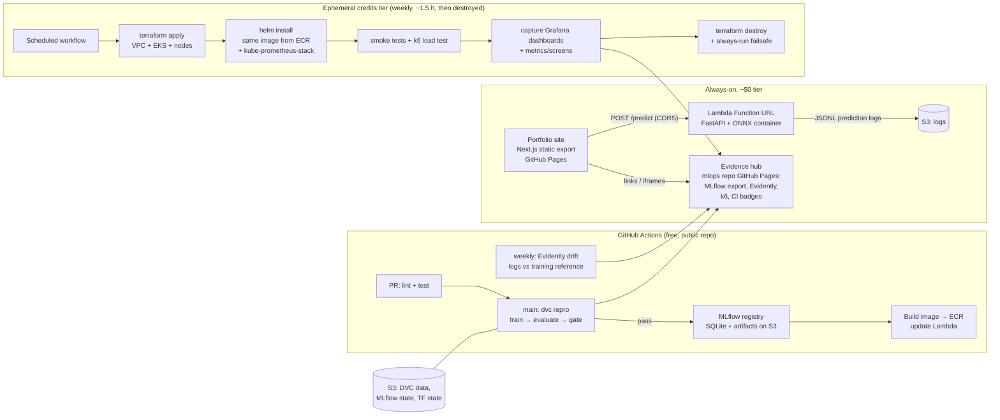

# MLOps Platform — Implementation Plan

**Project:** End-to-end MLOps platform for live sketch recognition (Google QuickDraw), with
[monishkamwal.github.io](https://monishkamwal.github.io) as the public, interactive frontend
and evidence hub.

**Goal:** Job-search portfolio + hands-on learning. Engineering depth over model sophistication;
the public demo must be visually engaging. Budget: AWS free tier + ~$100–200 credits.

**Companion doc:** `PORTFOLIO_PLAN.md` in the `monishkamwal.github.io` repo covers the frontend.

**Working style:** one-time and admin actions (AWS budgets/alarms, GitHub repo settings, Pages
configuration, branch cleanup, repo variables/secrets) are done through the **web UI** (AWS
Console / github.com) — the plan gives click paths, not CLI commands. The exception is anything
that *is* the platform: AWS resources stay in Terraform (an explicit project requirement) and
automation stays in GitHub Actions workflows. UI for setup, code for the system.

---

## 1. The ML problem (confirmed choice)

**Sketch recognition on the Google QuickDraw dataset, ~15 classes.** Visitors draw on an HTML
canvas; the deployed model classifies the doodle live.

This is the right problem for the stated goals, so no alternative is proposed:

- **Interactive and visual** — a drawing canvas is the most engaging demo a static site can host.
- **Tiny model, real pipeline** — a small CNN on 28×28 grayscale bitmaps trains to ~90%+ accuracy
  in minutes on a free GitHub Actions CPU runner, so the *entire* training pipeline can run in CI.
- **Natural drift story** — real visitor drawings differ from QuickDraw's distribution (different
  devices, styles, unprompted subjects), giving Evidently something genuine to detect, not a
  synthetic demo.
- **Public, well-known dataset** — Google hosts preprocessed 28×28 numpy bitmaps per class in a
  public GCS bucket; no licensing or scraping concerns.

**Class subset (initial 15, tunable in `params.yaml`):** cat, dog, fish, bird, apple, banana,
house, tree, car, bicycle, airplane, clock, star, umbrella, face. Chosen for visual distinctness
and drawability in under 10 seconds.

---

## 2. Key decisions (summary table)

Each row is also an interview talking point: chosen tool, one-line why, and the rejected alternative.

| Concern | Choice | Why | Alternative considered |
|---|---|---|---|
| ML framework | **PyTorch** | Industry-default for interviews; simple training loop for a small CNN | TF/Keras — equally capable here, less common in target job listings |
| Serving format | **ONNX (exported from PyTorch)** | onnxruntime is a ~50 MB dependency vs ~800 MB for torch → small images, fast Lambda cold starts | TorchScript — keeps one framework but drags full torch into the serving image |
| Inference API (always-on tier) | **AWS Lambda (container image) + Function URL** | Always-free tier (1M req/mo), true scale-to-zero, native CORS on Function URLs, provisioned by the same Terraform as everything else | HF Spaces — free but sleeps for ~long cold starts, not Terraform-manageable, splits the infra story across providers. API Gateway — adds cost/complexity over Function URL for zero benefit here |
| Lambda/K8s parity | **One FastAPI image, run on Lambda via AWS Lambda Web Adapter** | Identical artifact serves both tiers — zero code fork between Lambda and EKS | Mangum — needs an ASGI-handler code path just for Lambda |
| Data versioning | **DVC with S3 remote** | Boring, well-documented, doubles as the reproducible pipeline runner (`dvc repro`) | lakeFS/Git LFS — heavier or weaker fit for pipeline DAGs |
| Data validation | **Pandera** | Lightweight, code-first schemas; fits validating metadata + prediction-log dataframes; GE is table-report machinery this image dataset doesn't need | Great Expectations — richer HTML data docs, but heavy setup for ~2 dataframes |
| Experiment tracking + registry | **MLflow with SQLite backend, state synced to S3, static HTML export** | SQLite backend enables the real Model Registry (file backend doesn't); single CI writer avoids concurrency issues; zero always-on cost | Managed MLflow (Databricks/self-hosted EC2) — always-on cost violates budget |
| CI/CD | **GitHub Actions** | Free unlimited minutes on public repos; OIDC to AWS (no stored keys) | Nothing else is close for a public GitHub portfolio |
| Registry→deploy gate | **Metric comparison vs best-validated champion (alias in MLflow registry)** | Blocks deploy if accuracy regresses > ε; re-crowns only on a strict improvement so the bar never erodes; simple, explainable | Full shadow deploy — overkill at this scale |
| IaC | **Terraform, two roots: `persistent/` and `ephemeral/`** | Persistent (S3/ECR/IAM/Lambda/budgets) applied once, ~$0 idle; ephemeral (VPC/EKS) created and destroyed weekly | Single root — one `destroy` mistake could delete state buckets and the live API |
| TF state | **S3 backend with native S3 locking (TF ≥ 1.11)** | One less service to manage | DynamoDB lock table — the classic pattern, now unnecessary |
| K8s deploy | **Helm chart, ClusterIP + `kubectl port-forward` for tests** | No public LB → no idle/hourly LB cost, no DNS/TLS yak-shaving, smaller attack surface; evidence is captured, not served live | NLB/ALB Ingress — the production answer; noted in the chart as a values toggle |
| Load testing | **k6 (+ HTML report)** | Single binary, scriptable in JS, exports static HTML evidence | Locust — needs Python workers, more moving parts |
| Drift monitoring | **Evidently (static HTML reports)** | Purpose-built drift reports; free; renders to static HTML for the evidence hub | Prometheus+Grafana for drift — wrong tool for distribution comparisons; they own the operational-metrics story instead (next row) |
| Service metrics & dashboards | **Prometheus + Grafana (kube-prometheus-stack), installed during each EKS run; dashboards as code** | FastAPI exposes `/metrics`; Grafana dashboards (JSON in repo) show latency/RPS/errors live under k6 load; rendered screenshots become evidence — full observability story at zero standing cost | Always-on Grafana Cloud free tier — real, but splits the infra story across providers; CloudWatch covers the Lambda tier, which Prometheus can't scrape anyway |
| Prediction logging | **FastAPI middleware → JSONL to S3** | At portfolio traffic, direct `put_object` per request is free and simple | Kinesis Firehose — the "at scale" answer, pure cost here |
| Evidence hosting | **`mlops` repo's own GitHub Pages** (`monishkamwal.github.io/mlops/`) | Publishing evidence uses the default `GITHUB_TOKEN` — no cross-repo PAT; portfolio site just links/iframes it | Committing HTML into the portfolio repo — couples repos, needs a PAT, pollutes site history |
| Python tooling | **uv + ruff + pytest + pre-commit, Python 3.12** | Fast, current, minimal config | pip/poetry, flake8+black — more tools, same outcome |
| Branching | **Trunk-based: feature branch → PR → `main`** | CI on PR, deploy from `main`; right-sized for a solo project | The existing `develop`/`staging` remote branches will be deleted |

**Train/serve skew — one deliberate design rule:** the browser sends the raw drawing (stroke
list + 280×280 PNG); *all* preprocessing down to the 28×28 model input happens server-side in
Python, in the same module used by the training pipeline. One code path, no JS reimplementation
of preprocessing. This is a headline interview point.

---

## 3. Architecture



Two AWS S3 buckets (data/state vs logs), one ECR repo, one Lambda — that is the entire
*persistent* AWS footprint.

---

## 4. Repository layout (target end state)

```
mlops/
├── .github/workflows/
│   ├── ci.yml                  # PR: ruff, pytest, docker build check
│   ├── train-deploy.yml        # main: dvc repro → gate → ECR → Lambda; publishes evidence
│   ├── eks-demo.yml            # weekly: apply → helm → smoke+k6 → capture → destroy
│   ├── eks-failsafe.yml        # scheduled sweep: destroy anything tagged, hours after demo
│   ├── drift-report.yml        # weekly: Evidently report → evidence hub
│   └── evidence-pages.yml      # assembles + deploys the evidence site (mlops repo Pages)
├── src/quickdraw/
│   ├── data/                   # download.py, preprocess.py (shared with serving!), validate.py (Pandera)
│   ├── training/               # model.py, train.py, evaluate.py, export_onnx.py, gate.py
│   ├── serving/                # app.py (FastAPI), predictor.py, prediction_logger.py
│   └── monitoring/             # drift_report.py, mlflow_static_export.py
├── tests/                      # unit tests incl. preprocessing-parity tests
├── data/                       # DVC-managed (raw/, processed/) — pointers only in git
├── dvc.yaml                    # stages: download → preprocess → validate → train → evaluate → export
├── params.yaml                 # classes, samples/class, epochs, lr, gate thresholds
├── Dockerfile                  # FastAPI + onnxruntime + Lambda Web Adapter (one image, both tiers)
├── deploy/helm/quickdraw-api/  # chart: deployment, service, HPA, ServiceMonitor; values toggle for LB
├── deploy/grafana/dashboards/  # dashboards-as-code (JSON), provisioned into each EKS run
├── infra/
│   ├── persistent/             # S3 ×2, ECR, Lambda + Function URL, IAM OIDC roles, budgets/alarms
│   └── ephemeral/              # VPC, EKS, managed node group (spot) — applied/destroyed weekly
├── scripts/                    # evidence assembly, tag-scoped resource sweeper, helpers
├── evidence/                   # templates/index for the evidence site
├── pyproject.toml              # uv-managed
└── PLAN.md / README.md
```

---

## 5. Phases

Strictly sequential; each phase ends with something demoable. Later phases never block the
previous phase's demo from continuing to work.

---

### Phase 0 — Foundations & cost guardrails (short; do before any AWS usage)

**Goals:** Repos, tooling, and *billing protection* in place before a single resource exists.

**Tasks:**
1. Rewrite `mlops` README to match actual scope (single QuickDraw model — the "three ML models"
   line was a mistake). Delete stale `develop`/`staging` branches on both remotes via GitHub UI:
   repo → **Branches** page → trash icon next to each.
2. Scaffold Python project: `uv init`, `pyproject.toml`, ruff, pytest, pre-commit; `src/` layout above.
3. AWS account hygiene **via the AWS Console**: no root usage for daily work; create
   **AWS Budgets** ($10 warn / $25 alarm / $50 stop-and-investigate emails) under
   *Billing & Cost Management → Budgets*, and a billing alarm under *CloudWatch → Alarms →
   Billing* (region us-east-1 for billing metrics). Do this *before* Terraform exists —
   guardrails must predate resources.

   > **Reality check (2026-07-03):** the account is on the post-July-2025 **free account
   > plan** ($100 + up to $100 earned credits, 6-month window, *cannot incur charges*).
   > Budgets are done; the CloudWatch billing alarm is **deferred** — it's meaningless until
   > a paid-plan upgrade, since a free-plan account bills $0 by construction. Revisit at the
   > Phase 3 upgrade decision.
4. Terraform `infra/persistent`: create the **TF state bucket by hand in the S3 Console**
   (versioning on — standard one-time bootstrap), then Terraform everything else: S3 buckets,
   ECR repo (lifecycle policy: keep last 3 images — ECR free tier is 500 MB), GitHub OIDC
   provider + two IAM roles (`gha-app` scoped to S3/ECR/Lambda; `gha-infra` for the EKS
   workflow), all resources tagged `project=mlops-quickdraw`. Add the resulting role ARNs +
   region as repo **variables** via GitHub UI: repo → *Settings → Secrets and variables →
   Actions → Variables*.
5. Portfolio repo: Next.js scaffold + Pages deploy workflow (see `PORTFOLIO_PLAN.md`).

**Demoable:** `terraform apply` output showing the persistent footprint; a green "hello world"
CI run; empty portfolio site live on Pages.

**Estimated AWS cost:** < $0.10/mo (S3 pennies; everything else free tier).

**Definition of done:**
- [ ] Budgets + billing alarm active and test-fired
- [ ] `terraform apply` in `infra/persistent` is idempotent from a clean checkout
- [ ] GitHub Actions can assume the AWS role via OIDC (no stored keys anywhere)
- [ ] Portfolio site deploys to Pages on push to `main`

---

### Phase 1 — Walking skeleton (data → train → serve → live canvas demo)

**Goals:** The thinnest end-to-end slice: a visitor can draw on the portfolio site and get a
live classification from a model you trained. Everything else in the project upgrades pieces
of this skeleton.

**Tasks:**
1. **Data:** `download.py` pulls the 15 class `.npy` bitmap files from Google's public GCS
   bucket, samples N=10k/class; `preprocess.py` normalizes, splits train/val/test
   (deterministic seed). Also implements `strokes_or_png → 28×28 tensor` for serving (the
   shared code path).
2. **Training:** small CNN in PyTorch (~2 conv blocks + FC; target ≥ 88% val accuracy),
   `train.py` logs params/metrics/artifacts to MLflow (local `sqlite:///mlflow.db` for now),
   `evaluate.py` produces confusion matrix + per-class metrics, `export_onnx.py` exports and
   verifies ONNX output parity vs PyTorch (unit test).
3. **Serving:** FastAPI app — `POST /predict` (accepts stroke list + PNG), `GET /healthz`,
   `GET /model-info` (version, metrics), `GET /metrics` (Prometheus format via
   prometheus-fastapi-instrumentator — nothing scrapes it on Lambda, but it makes the image
   observability-ready for Phase 3 at zero extra cost). onnxruntime inference. Dockerfile with
   Lambda Web Adapter. Runs identically via `docker run` locally and on Lambda.
4. **Deploy:** add Lambda (container image) + Function URL to `infra/persistent`; CORS allowlist
   = `https://monishkamwal.github.io` + localhost. Manual image push for now (automation is Phase 2).
5. **Frontend:** canvas demo page on the portfolio home (see `PORTFOLIO_PLAN.md`) calling the
   Function URL. Handle cold start UX (a warm-up ping on page load + "model waking up…" state).
6. **Prediction logging v0:** middleware writes JSONL records (timestamp, input digest, top-3
   classes, confidence, latency; no PII) to the logs bucket — from day one, so Phase 4 has
   months of real data.

**Tools introduced:** PyTorch, ONNX/onnxruntime, MLflow (local), FastAPI, Docker, Lambda Web
Adapter (justifications in §2).

**Demoable:** **Draw a cat on monishkamwal.github.io; see it classified live**, with confidence
bars. `docker run` locally gives the same API.

**Estimated AWS cost:** ~$0/mo (Lambda + S3 well inside always-free tier; ECR ~free with
lifecycle policy).

**Definition of done:**
- [ ] `uv run python -m quickdraw.training.train` reproduces a ≥ 88% val-accuracy model from scratch
- [ ] ONNX-vs-PyTorch parity test passes; preprocessing-parity test (stroke fixture → same tensor in train & serve paths) passes
- [ ] Live canvas on the portfolio site returns predictions with CORS working; cold-start UX handled
- [ ] Prediction logs visibly accumulating in S3

---

### Phase 2 — Automation: DVC, CI/CD, quality gates, evidence publishing

**Goals:** No manual steps between "merge to main" and "new model live", with a quality gate
that can say no. Evidence hub goes live.

**Tasks:**
1. **DVC:** init with S3 remote; `dvc.yaml` stages `download → preprocess → validate → train →
   evaluate → export`; `params.yaml` for classes/hyperparams/gate thresholds. `dvc repro` is now
   *the* way to run the pipeline (locally and in CI).
2. **Validation stage:** Pandera schemas over dataset metadata (per-class counts, pixel value
   ranges, label set, split sizes) — pipeline fails loudly on bad data.

   > **Amended 2026-07-18:** the stage validates the *processed* artifact, so it sits between
   > preprocess and train (originally sketched before preprocess). Every check above describes
   > the npz, malformed raw data already crashes preprocess loudly, and training is the
   > expensive silent consumer — the gate belongs at its door, enforced as a DVC dependency
   > edge (train depends on the validation report).
3. **MLflow on S3:** CI pulls `mlflow.db` + artifact store from S3, runs tracked training,
   pushes back (single-writer: workflow `concurrency` group). Registry with aliases
   `champion` / `challenger`.

   > **Amended 2026-07-18:** only `mlflow.db` syncs (`scripts/mlflow_sync.sh pull|push`);
   > artifacts write to S3 *natively* — MLflow records artifact roots as absolute URIs, so a
   > synced `mlruns/` would bake laptop paths into the shared DB and break on any other
   > machine, while `s3://` roots are portable by construction. `MLFLOW_STATE_BUCKET` unset →
   > fully local and AWS-free (same env-presence switch as `PREDICTION_LOG_BUCKET`). The
   > laptop-era `mlflow.db` is archived, not shared: its experiment carries a local artifact
   > root — shared history starts the day tracking became shared infrastructure.
4. **Quality gate (`gate.py`):** challenger must beat champion's test accuracy − ε (ε=0.5pp) AND
   exceed absolute floor (85%). Pass → proceed (ship the challenger); fail → workflow fails with
   a metric-diff summary in the job annotation.

   > **Amended 2026-07-20:** *deploy and re-crown are decoupled.* Passing means "ship this
   > challenger"; the `champion` alias moves only on a **strict improvement**
   > (`challenger > champion`), not on every pass. So `champion` is the best model ever
   > validated — a non-eroding quality bar — rather than a record of what's deployed. The
   > original "pass → promote" would let a string of within-ε challengers ratchet the champion
   > (hence the gate's own baseline) down by up to ε each run; anchoring to the high-water mark
   > removes that drift. Trade-off, taken deliberately: the live model may sit up to ε below
   > champion, and no alias tracks "currently deployed" — the deploy workflow's built image is
   > the source of truth for what's live, while `champion` is the quality reference the gate
   > compares against. `gate.py` is a CLI run *after* `dvc repro`, not a DVC stage: it mutates
   > registry state and reads S3-synced MLflow, so it's orchestration, not a pure pipeline step.
5. **CI workflows:**
   - `ci.yml` (PRs): ruff, pytest, docker build (no push). Make it a required check via
     GitHub UI: repo → *Settings → Branches → Add branch ruleset* on `main`.
   - `train-deploy.yml` (push to `main` touching `src/`, `dvc.yaml`, `params.yaml`; +
     `workflow_dispatch`): `dvc repro` → gate → build/push image to ECR (tag = git SHA +
     model version) → `aws lambda update-function-code` → smoke test the Function URL →
     publish evidence.
6. **Evidence hub:** enable GitHub Pages on the `mlops` repo via UI (repo → *Settings →
   Pages → Source: GitHub Actions*).
   `mlflow_static_export.py` renders runs table + metric charts (plotly → static HTML);
   publish alongside evaluation reports (confusion matrix), CI status badges, and later k6 +
   Evidently outputs. `evidence-pages.yml` assembles `evidence/` + generated artifacts →
   deploy. Portfolio site links/iframes these pages.

   > **Amended 2026-07-21:** the renderer is `quickdraw.evidence.export` (module, run as
   > `python -m quickdraw.evidence.export`), and it reads the **MLflow registry** as the
   > source of truth for champion state rather than the checked-in metrics snapshot (which
   > drifts from the CI-trained champion). Besides `index.html` it emits **`evidence.json`**,
   > a styling-agnostic data contract — the portfolio site consumes that JSON and renders its
   > own styled components, so the hub's HTML/CSS stay throwaway. `build_data()` (pure JSON)
   > and `build_context()` (data + presentation) keep the two concerns separate.
7. Add model card (`MODEL_CARD.md`, rendered into evidence).

   > **Amended 2026-07-21:** `MODEL_CARD.md` lives at the repo root and is rendered into the
   > hub as a section (Python-Markdown) by `quickdraw.evidence.export`, with the raw `.md`
   > copied to the site so the portfolio can consume the source. Its headline metrics are a
   > reference point; the hub's registry-fed numbers are authoritative.

**Tools introduced:** DVC, Pandera, MLflow registry semantics, GitHub OIDC deploy path,
evidence pipeline.

**Demoable:** Open a PR → green checks. Bump `epochs` in `params.yaml`, merge → watch
train → gate → deploy run end-to-end → `model-info` on the live API shows the new version.
Evidence hub live at `monishkamwal.github.io/mlops/` showing the experiment history. Also demo
a *failing* gate (train with crippled lr on a branch) — a blocked deploy is the best CI/CD story.

**Estimated AWS cost:** < $1/mo (S3 storage for DVC data ~1–2 GB + MLflow artifacts; requests
negligible).

**Definition of done:**
- [ ] Fresh clone + `dvc pull && dvc repro` reproduces the pipeline byte-for-byte (modulo training seed noise)
- [ ] Merge to `main` with a model-affecting change auto-deploys a gated model with zero manual steps
- [ ] A deliberately bad model is demonstrably blocked by the gate (kept as a linked CI run in evidence)
- [ ] Evidence hub live with MLflow export + eval report; linked from portfolio site

---

### Phase 3 — Ephemeral EKS layer (Terraform + Helm + weekly spin-up/teardown)

**Goals:** Demonstrate real Kubernetes deployment via IaC — provisioned, exercised, evidenced,
and destroyed automatically, at ~$0 idle cost.

> **Account-plan gate (added 2026-07-03):** the account is on the free plan, which blocks a
> subset of credit-hungry services — EKS is likely among them. **Task 0:** check the EKS
> console; if blocked, upgrade to the paid plan first (direct upgrade carries remaining
> credits over) and only then create the ephemeral root. The deferred CloudWatch billing
> alarm from Phase 0 becomes mandatory at the moment of upgrade — that's when real charges
> become possible.

**Tasks:**
1. **Terraform `infra/ephemeral`:** `terraform-aws-modules/vpc` (2 AZ, single NAT) +
   `terraform-aws-modules/eks` (K8s 1.31+, one managed node group: 2× t3.medium **spot**).
   Separate state key. Everything tagged `project=mlops-quickdraw`, `tier=ephemeral`.
2. **Helm chart** `deploy/helm/quickdraw-api`: Deployment (image from ECR by digest), probes
   wired to `/healthz`, resource requests/limits, Service (ClusterIP), optional HPA;
   `values.yaml` toggle for LoadBalancer (documented, not used in the weekly run).
3. **`eks-demo.yml` (weekly schedule + `workflow_dispatch`):**
   1. `terraform apply` (ephemeral root)
   2. `helm upgrade --install` the current production image (the image the Lambda tier is
      serving — i.e. the last challenger to pass the gate; `champion` is the quality baseline,
      not necessarily the deployed version — see Phase 2 task 4)
   3. Smoke tests via `kubectl port-forward` (same test suite as Lambda smoke tests)
   4. k6 load test through the port-forward (e.g., 20 VUs / 3 min) → HTML report
   5. Capture evidence: `kubectl get all -o wide`, `kubectl top nodes/pods`, rollout history,
      k6 report, timing of each step
   6. **`destroy` job with `if: always()`**, plus `concurrency` group preventing overlapping runs,
      plus job-level `timeout-minutes` on every step
   7. Publish evidence to the hub with run date
4. **Failsafe (`eks-failsafe.yml`):** scheduled ~3 h after the demo window; runs
   `terraform destroy` against ephemeral state unconditionally, then a boto3 sweeper script that
   lists any surviving EKS clusters / EC2 / NAT gateways / EIPs / ELBs carrying the project tag
   and deletes them, then posts a summary. Also `workflow_dispatch`-able as the "break glass" button.
5. **Observability (Prometheus + Grafana):** install **kube-prometheus-stack** via Helm at the
   start of each run; a `ServiceMonitor` in the API chart points Prometheus at the FastAPI
   `/metrics` endpoint (instrumented since Phase 1). Grafana dashboards live as JSON in
   `deploy/grafana/dashboards/` and are provisioned via Helm values — **dashboards as code**,
   nothing hand-built in the UI. Two dashboards: API (p50/p95/p99 latency, RPS, error rate,
   in-flight requests) and cluster (node/pod CPU + memory). The k6 load test then has a live
   audience: capture dashboard PNGs via Grafana's render endpoint during and after the load
   window → evidence hub.

**Tools introduced:** Terraform AWS modules, EKS, Helm, k6, Prometheus + Grafana
(kube-prometheus-stack).

**Demoable:** The weekly workflow's run page (public!) showing apply → deploy → test → destroy,
and the evidence hub page with the k6 report, Grafana dashboards mid-load-test, and cluster
snapshots. "Here's my cluster from last Tuesday under load; it no longer exists, and here's the
dashboard proving it handled it" is exactly the ephemeral-infra story.

**Estimated AWS cost:** per run (~90 min): EKS control plane $0.15 + 2× t3.medium spot ~$0.04 +
NAT ~$0.08 + misc ≈ **$0.30–0.60/run → $2–3/mo**. A *leaked* cluster would be ~$8/day — hence
the failsafe design (see §6).

**Definition of done:**
- [ ] Two consecutive scheduled runs complete apply→destroy unattended with published evidence
- [ ] Grafana dashboards (provisioned from repo JSON) captured under k6 load in those runs
- [ ] Kill-test passed: cancel the workflow mid-run, confirm failsafe destroys everything within its window
- [ ] `aws resourcegroupstaggingapi get-resources --tag-filters Key=project...` returns zero ephemeral resources the morning after a run
- [ ] Cost Explorer shows the run cost within estimate

---

### Phase 4 — Monitoring, drift detection & portfolio polish

**Goals:** Close the loop: live traffic → drift reports → (manual) retrain decision. Portfolio
becomes a complete, navigable story.

**Tasks:**
1. **Reference dataset:** freeze a training-distribution sample (features + predicted-class
   distribution from a held-out set) as the Evidently reference, versioned with DVC.
2. **`drift-report.yml` (weekly):** pull prediction logs from S3 → build current-window
   dataframe (pixel-intensity stats, stroke counts, confidence distribution, predicted-class
   mix) → Pandera-validate → Evidently data-drift + prediction-drift report → static HTML →
   evidence hub, with a small trend index page (drift score over weeks).
3. **Feedback signal:** portfolio canvas gets "did I guess right? 👍/👎" → logged to S3 →
   weekly proxy-accuracy chart joins the drift report (real ground-truth-ish labels from real
   users — strong talking point).
4. **Alerting-lite:** if drift score crosses threshold, the workflow opens a GitHub issue
   (`drift-alert` label) — the "page a human" step, right-sized.
5. **Retrain path:** documented `workflow_dispatch` on `train-deploy.yml` optionally mixing
   logged real drawings (above a confidence/feedback bar) into training data — even if only
   demonstrated once, it completes the data flywheel narrative.
6. **Portfolio polish (details in `PORTFOLIO_PLAN.md`):** architecture diagram (clickable →
   journey entries), per-component write-ups, journey/devlog section covering decisions & wrong
   turns, evidence hub integration, README overhaul with badges and architecture diagram.
7. Final cost review: Cost Explorer screenshot for the whole project month → itself published
   as evidence ("the entire platform runs on <$5/mo").

**Tools introduced:** Evidently.

**Demoable:** Live drift dashboard (static, weekly-updated) fed by real visitor drawings; the
full portfolio narrative from canvas → CI → EKS → drift, every claim backed by a public artifact.

**Estimated AWS cost:** ~$0 incremental (S3 reads + tiny storage).

**Definition of done:**
- [ ] Two consecutive weekly drift reports generated from real visitor logs
- [ ] Feedback buttons live; proxy-accuracy chart rendering
- [ ] Drift-threshold GitHub issue path test-fired once
- [ ] Portfolio site complete: demo, architecture, journey, evidence — no dead links (link check in site CI)

---

## 6. Cost guardrails

Budget: free tier + $100–200 credits. Target steady state: **< $5/mo**; worst credible
accident: leaked EKS+NAT ≈ $8–10/day — survivable for days, not weeks, hence layered defenses:

1. **Budgets before resources** (Phase 0): AWS Budgets at $10 (warn), $25 (alarm), $50
   (stop work, investigate) + CloudWatch billing alarm. Emails to your Outlook address.
2. **Two-root Terraform:** the weekly workflow physically cannot destroy or modify the
   persistent tier; the `gha-infra` IAM role for the ephemeral workflow is scoped so it can't
   touch state/data buckets beyond its own state key.
3. **Teardown, three layers deep:**
   - `destroy` job with `if: always()` in `eks-demo.yml` (runs on success, failure, or cancel)
   - `eks-failsafe.yml` scheduled hours later: unconditional `terraform destroy` + tag-scoped
     boto3 sweeper (EKS, EC2, NAT, EIP, ELB, ENI) + summary report
   - Manual break-glass: same failsafe via `workflow_dispatch`, documented in README
4. **Workflow hygiene:** `concurrency` groups (no overlapping cluster runs), `timeout-minutes`
   on every job, spot instances (cheap AND auto-reclaimed), no public LoadBalancer by default.
5. **Standing-cost tripwires:** ECR lifecycle policy (last 3 images), S3 lifecycle rule
   (prediction logs → expire after 180 days), no NAT/EIP/LB in the persistent tier at all.
6. **Weekly habit:** glance at Cost Explorer after each EKS run (or add a cost line to the
   evidence page — see Phase 4.7).

---

## 7. Risks

| Risk | Likelihood | Impact | Mitigation |
|---|---|---|---|
| Leaked EKS/NAT burns credits | Low (after §6) | High | Three-layer teardown, budgets, tags, kill-test in Phase 3 DoD |
| Lambda cold start hurts demo UX | High | Medium | Warm-up ping on page load, "waking up" UI state, small ONNX image; measure — if p95 cold start > ~4 s, consider scheduled warming ping (EventBridge, free) |
| Train/serve skew (canvas ≠ QuickDraw bitmaps) | Medium | High (silently wrong demo) | Server-side preprocessing, shared module, parity unit test; drift monitoring will surface residual skew — which is itself a good story |
| Real drawings classified poorly (QuickDraw is a weird distribution) | Medium | Medium | Pick visually distinct classes; show top-3 with confidences (graceful when wrong); Phase 4 feedback + optional retrain on real data |
| MLflow SQLite corruption via concurrent CI writers | Low | Medium | Workflow `concurrency` group = single writer; S3 versioning on the bucket as undo |
| GitHub Actions runner limits (CPU training too slow) | Low | Medium | 15 classes × 10k samples trains in minutes; params.yaml lets you shrink further; cache datasets via DVC pull |
| ECR 500 MB free tier exceeded | Medium | Trivial | Lifecycle policy; slim base image; worst case ~$0.10/GB-mo |
| CORS/Function URL misconfiguration blocks the demo | Medium | Medium | CORS config in Terraform (reviewed, versioned), smoke test hits the URL with an Origin header in CI |
| Scope creep (this plan is already large) | High | High | Phases are strictly sequential; each ends demoable — stopping after any phase still leaves a coherent portfolio |
| AWS free tier changes / credits expiry | Low | Medium | Steady state <$5/mo is survivable without credits; ephemeral tier can be paused by disabling one workflow |

---

## 8. Suggested order of first commits (Phase 0 kickoff)

1. `README.md` rewrite + delete stale branches (GitHub UI)
2. `pyproject.toml` + tooling + empty package skeleton + first passing test in CI
3. AWS budgets/alarms (Console) — screenshot into `evidence/`
4. `infra/persistent` (state bucket via S3 Console → rest via Terraform)
5. Then Phase 1, task 1.

*Plan authored 2026-07-02. Treat `params.yaml` and this plan as living documents; when reality
disagrees with the plan, update the plan — the diffs become Journey content.*
