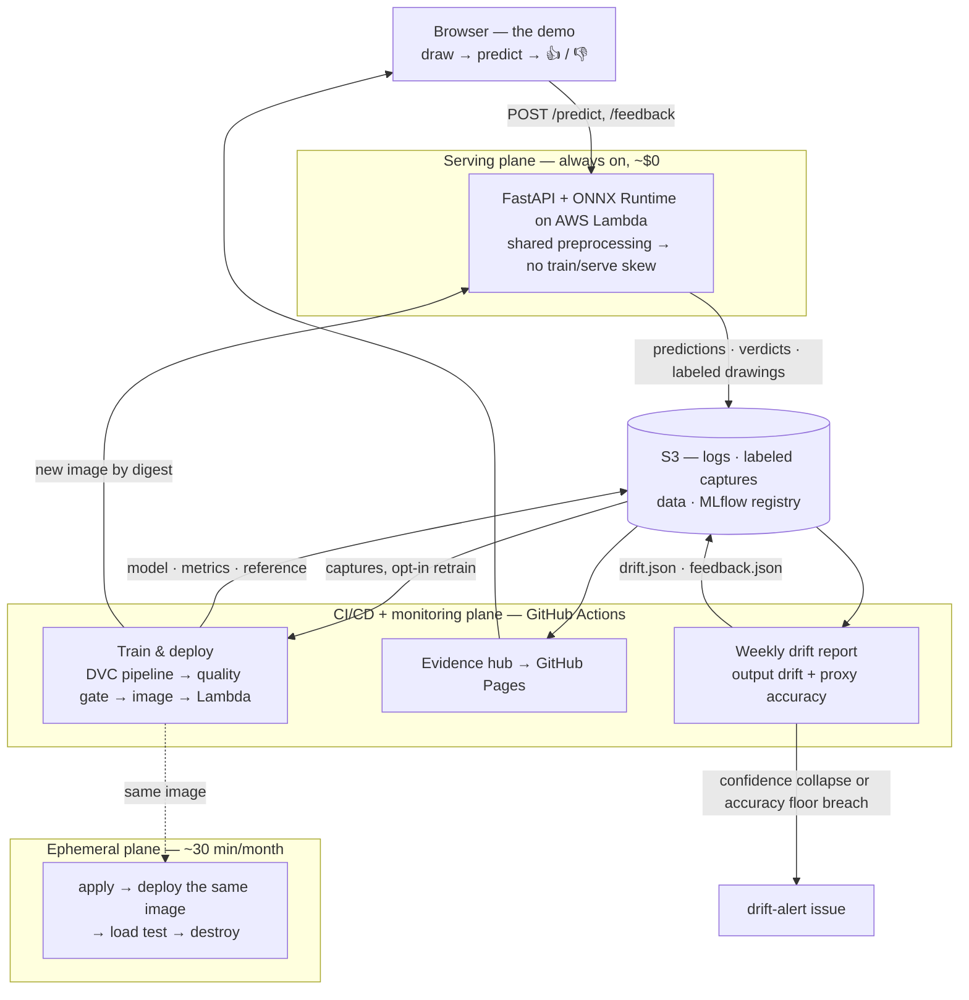

# QuickDraw MLOps Platform

[](https://github.com/MonishKamwal/mlops/actions/workflows/ci.yml)
[](https://github.com/MonishKamwal/mlops/actions/workflows/train-deploy.yml)
[](https://github.com/MonishKamwal/mlops/actions/workflows/drift-report.yml)
[](https://github.com/MonishKamwal/mlops/actions/workflows/evidence-pages.yml)

End-to-end MLOps platform for **live sketch recognition** on the
[Google QuickDraw](https://quickdraw.withgoogle.com/data) dataset. Visitors draw on a canvas at
[monishkamwal.github.io](https://monishkamwal.github.io) and a deployed model classifies the
doodle in real time.

**[Try the demo](https://monishkamwal.github.io)** ·
**[Evidence hub](https://monishkamwal.github.io/mlops/)** ·
**[Architecture](ARCHITECTURE.md)** · **[Model card](MODEL_CARD.md)** ·
**[Plan & decision log](PLAN.md)**

A visitor's drawing becomes a prediction, a log line, and — if they grade it — labeled training
data. Every merge retrains, gates, and redeploys the model without a human. Every week the logs
are scored for drift. Every artifact behind those claims is published.

The model is deliberately small (a CNN over 28×28 bitmaps, 15 classes, ~91.7% test accuracy);
the point is the **platform around it**.

## System overview



[`ARCHITECTURE.md`](ARCHITECTURE.md) has the detailed version — every plane, the DVC DAG, gate
semantics, the retrain flywheel, storage and IAM maps.

## What's in it

- **Pipeline & data:** DVC (S3 remote) runs `download → preprocess → validate → train →
  evaluate → export → reference`. Pandera validates the processed artifact and *gates* training
  through a dependency edge — no report, no training.
- **Tracking & registry:** MLflow (SQLite state synced to S3) with `champion`/`challenger`
  aliases. The gate blocks a deploy below an absolute floor (0.85) or on a regression beyond
  ε=0.005 — and re-crowns the champion **only** on a strict improvement, so the bar never erodes.
  Both paths are proven in production, including a deliberately crippled model being blocked.
- **Serving:** one FastAPI + onnxruntime container image (arm64) serves both tiers — AWS Lambda
  behind a Function URL (always on, ~$0) and an **ephemeral EKS cluster** that Terraform and Helm
  create monthly, load-test with k6 under Prometheus/Grafana, and destroy. Three teardown layers.
- **CI/CD:** GitHub Actions with OIDC to AWS — no stored keys anywhere. Merge to `main` → train
  → gate → build → deploy by digest → smoke-test the live URL, zero manual steps.
- **Monitoring:** prediction logs feed a weekly Evidently report on the model's *output*
  distribution, plus proxy accuracy from 👍/👎 feedback. It alerts on confidence collapse, not on
  the ever-present out-of-distribution drift, which would fire every week and mean nothing.
- **Retrain flywheel:** a 👎 with a class correction becomes labeled training data, folded into
  the train split only (val/test stay pristine) behind a quality bar, and re-gated like any other
  challenger.
- **Evidence hub:** every claim above resolves to a public artifact. Public outputs ship as JSON
  data contracts (`evidence.json`, `drift.json`, `feedback.json`, `api-metrics.json`) that the
  portfolio site styles itself.

## Status

**Phases 0–3 complete; Phase 4 (monitoring, drift, flywheel) complete through task 5.** The
platform is live end-to-end: data → training → gated deploy → public canvas → prediction logs →
drift reports → retrain. Remaining: portfolio write-ups and a final cost review. See
[PLAN.md §5](PLAN.md) for the phase breakdown and every amendment reality forced on it.

Running cost: well under $5/month — the serving tier is scale-to-zero, monitoring is a weekly
workflow, and the Kubernetes tier exists for about 30 minutes a month.

## Development

Requires [uv](https://docs.astral.sh/uv/) (manages the Python 3.12 toolchain and venv).

```sh
uv sync                    # create venv + install dev dependencies
uv run pytest              # run tests
uv run ruff check .        # lint
uv run pre-commit install  # enable git hooks (once)
```

The pipeline runs through DVC — locally and in CI, the same way:

```sh
uv run dvc repro           # download → … → export → reference
uv run dvc metrics diff    # what the last change did to the metrics
```

Serving runs identically in a container and on Lambda:

```sh
docker build -t quickdraw-api .
docker run --rm -p 8080:8080 quickdraw-api   # POST /predict, GET /healthz, /model-info, /metrics
```

## License

[MIT](LICENSE)
