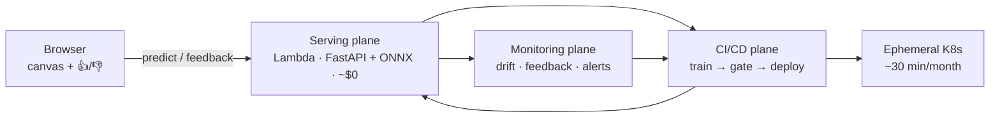

This is the **portfolio cut** of `ARCHITECTURE.md` — the trimmed, site-facing version you
edit by hand. Everything below the front matter is yours to rewrite; the converter copies each
section's markdown through untouched. Keep the deep detail (storage maps, IAM scoping, the full
DVC DAG) in `ARCHITECTURE.md` and keep only what reads well on the site here.

## System overview

Four planes: an always-on **serving plane** at ~$0, a **CI/CD plane** on GitHub Actions, an
**ephemeral Kubernetes plane** that exists ~30 minutes a month, and a **monitoring plane** that
closes the loop back into training.

**The one-sentence version:** a visitor's drawing becomes a prediction, a log line, and — if they
grade it — labeled training data; every merge retrains, gates, and redeploys the model without a
human; every week the logs are scored for drift; every artifact behind those claims is published.

## The retrain flywheel

The most distinctive part of the story, and it reads in one glance: a visitor draws, the model
guesses, and the visitor grades the guess (👍, or 👎 with the correct class). A 👍 labels the
drawing with the guess; a 👎 labels it with the correction. Those labeled drawings accumulate in
S3. On demand, a training run folds them into the **training split only** (val/test stay pristine,
so evaluation stays honest), registers a challenger, and the quality gate decides whether it ships.
The canvas → CI → deploy → drift → feedback → **retrain** loop closes without a human in it.

## The quality gate

The sharpest single idea in the project: **ship and re-crown are decoupled.** Every training run
produces a *challenger*; the gate compares it to the reigning *champion* on held-out test accuracy.
It applies two rules — an absolute floor (0.85) and no regression beyond a small epsilon. Pass →
the challenger ships to production. But the `champion` alias only moves on a *strict* improvement,
so "champion" always means best-ever quality bar, never merely "currently deployed" — and the
gate's baseline can never ratchet down. A crippled 0.50 model is blocked in CI, deploy steps skip,
and the live model is untouched.

## Ephemeral Kubernetes

The same serving image that runs on Lambda also runs on Kubernetes — proving the container is
portable and load-tested — but only for ~30 minutes a month. A workflow does **apply → exercise →
destroy**: Terraform brings up an EKS cluster (Graviton nodes) and a VPC, Helm deploys the API by
image digest, kube-prometheus-stack scrapes it, k6 drives load, and then everything is torn down.
A separate monthly *failsafe* sweeps any survivor tagged `tier=ephemeral`, so a botched teardown
can't quietly bill. No always-on cluster cost, anywhere.

## Evidence & drift

Every claim on the site is backed by a published artifact. The evidence hub renders from the
MLflow registry — champion/challenger history, the confusion matrix, the gate policy — and emits
`evidence.json`. The weekly drift report scores real predictions against a reference distribution
and emits `drift.json`; feedback verdicts become a proxy-accuracy signal in `feedback.json`; a
drift threshold breach opens a GitHub issue. The site styles all of it — including this very
document — from JSON contracts, never from the platform's own HTML.
